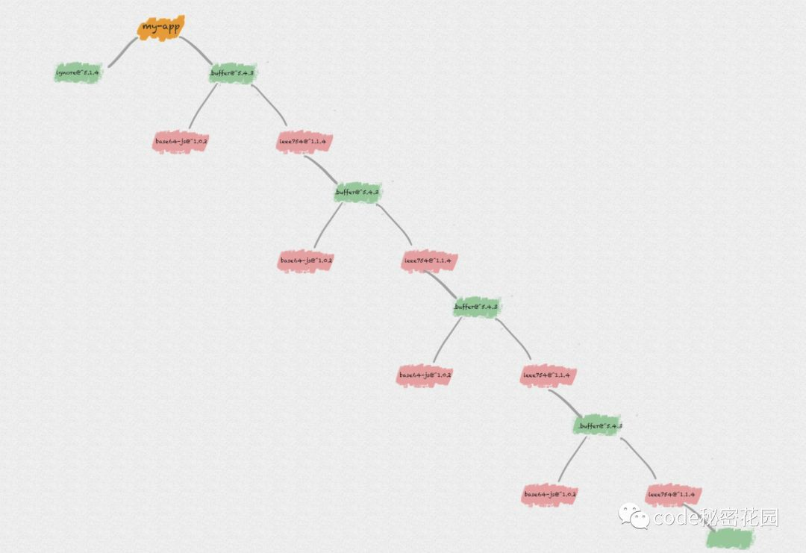
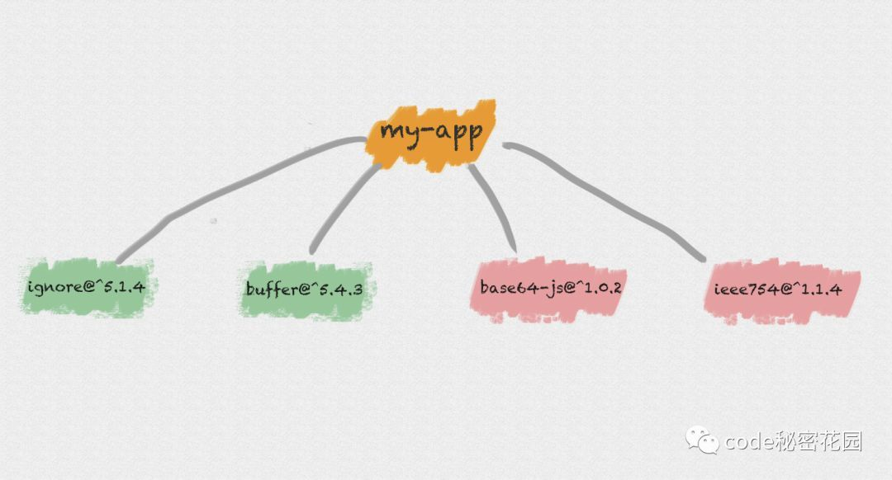
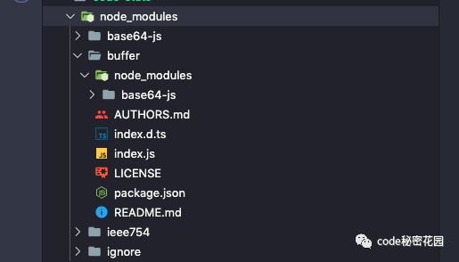
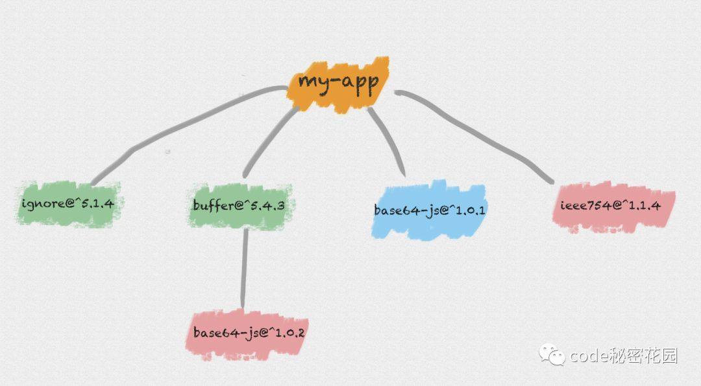
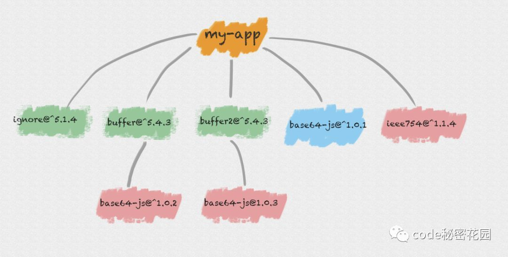

### 1、npx 有什么用？

1、调用项目安装的模块

比如，项目内部安装了测试工具 Mocha：

```bash
npm install -D mocha
```

那么以下两个命令都能执行 macha 命令

```bash
# 项目的根目录下执行
node-modules/.bin/mocha --version

npx mocha --version
```

2、避免全局安装模块

比如，`create-react-app` 这个模块是全局安装，npx 可以运行它，而且不进行全局安装：

```bash
npx create-react-app my-react-app
```

上面代码运行时，npx 将 `create-react-app` 下载到一个临时目录，使用以后再删除。所以，以后再次执行上面的命令，会重新下载 `create-react-app`。

相关链接：
[npx 使用教程](https://www.ruanyifeng.com/blog/2019/02/npx.html)

### 2、package.json 版本依赖中，~ 和 ^ 的区别是什么？

`~` 会匹配最近的小版本依赖包，比如 `~1.2.3` 会匹配所有 1.2.x 版本，但是不包括 1.3.0；
`^` 会匹配最新的大版本依赖包，比如 `^1.2.3` 会匹配所有 1.x.x 的包，包括 1.3.0，但是不包括 2.0.0；

### 3、用 npm 进行安装时，其内部发生了什么？

1. 从磁盘加载现有的node_modules树，并克隆树
1. 获取 `package.json` 和 分类的元数据 并将其添加到克隆树中
1. 遍历克隆并添加任何缺少的依赖项，依赖项将尽可能靠近顶部添加
1. 比较原始树和克隆树，并列出转换需要采取的动作
1. 执行所有动作，包括安装，更新，删除和移动

参考链接：

[NPM Docs](https://docs.npmjs.com/cli/v6/commands/npm-install#algorithm)

### 4、谈谈 node_modules 的目录结构

#### (1)、嵌套结构

`npm` v3 之前的版本用的是嵌套结构，举个例子：

我们的模块 `my-app` 现在依赖了两个模块：`buffer`、`ignore`：

```json
{
  "name": "my-app",
  "dependencies": {
    "buffer": "^5.4.3",
    "ignore": "^5.1.4",
  }
}
```

`ignore` 是一个纯 JS 模块，不依赖任何其他模块，而 `buffer` 又依赖了下面两个模块：`base64-js` 、 `ieee754`。

```json
{
  "name": "buffer",
  "dependencies": {
    "base64-js": "^1.0.2",
    "ieee754": "^1.1.4"
  }
}
```

那么，执行 `npm install` 后，得到的 `node_modules` 中模块目录结构就是下面这样的：


嵌套结构的优点很明显：

1. `node_modules` 的结构和 `package.json` 结构一一对应，每次安装的目录结构都一致
1. 不会有版本冲突问题

但是坏处也显而易见：

1. 在不同层级的依赖中，可能引用了同一个模块，导致大量冗余
1. 嵌套可能非常深，在 `Windows` 系统中，文件路径最大长度为260个字符，嵌套过深可能导致不可预知的问题



为了解决上面的问题，`npm` 后来采用了扁平结构。

#### (2)、扁平结构

`npm` 在 `3.x` 版本做了一次较大更新。其将早期的嵌套结构改为扁平结构：

- 安装模块时，不管其是直接依赖还是子依赖的依赖，优先将其安装在 `node_modules` 根目录

还是上面的依赖结构，我们在执行 npm install 后将得到下面的目录结构：




此时我们若在模块中又依赖了 `base64-js@1.0.1` 版本：

```json
{
  "name": "my-app",
  "dependencies": {
    "buffer": "^5.4.3",
    "ignore": "^5.1.4",
    "base64-js": "1.0.1",
  }
}
```

- 当安装到相同模块时，判断已安装的模块版本是否符合新模块的版本范围，如果符合则跳过，不符合则在当前模块的 `node_modules` 下安装该模块。

此时，我们在执行 npm install 后将得到下面的目录结构：





对应的，如果我们在项目代码中引用了一个模块，模块查找流程如下：

- 在当前模块路径下搜索
- 在当前模块 node_modules 路径下搜素
- 在上级模块的 node_modules 路径下搜索
- ...
- 直到搜索到全局路径中的 node_modules

假设我们又依赖了一个包 `buffer2@^5.4.3`，而它依赖了包 `base64-js@1.0.3`，则此时的安装结构是下面这样的：



所以 `npm 3.x` 版本并未完全解决老版本的模块冗余问题，甚至还会带来新的问题。

试想一下，你的APP假设没有依赖 `base64-js@1.0.1` 版本，而你同时依赖了依赖不同 `base64-js` 版本的 `buffer` 和 `buffer2`。由于在执行 `npm install` 的时候，按照 `package.json` 里依赖的顺序依次解析，则 `buffer` 和 `buffer2` 在 `package.json` 的放置顺序则决定了 `node_modules` 的依赖结构。

为了解决 `npm install` 的不确定性问题，在 `npm 5.x` 版本新增了 `package-lock.json` 文件，而安装方式还沿用了 `npm 3.x` 的扁平化的方式。

#### (3)、package-lock.json 的作用

`package-lock.json` 的作用是锁定依赖结构，即只要你目录下有 `package-lock.json` 文件，那么你每次执行 `npm install` 后生成的 `node_modules` 目录结构一定是完全相同的。

例如，我们有如下的依赖结构：

```json
{
  "name": "my-app",
  "dependencies": {
    "buffer": "^5.4.3",
    "ignore": "^5.1.4",
    "base64-js": "1.0.1",
  }
}
```

在执行 `npm install` 后生成的 `package-lock.json` 如下：

```json
{
  "name": "my-app",
  "version": "1.0.0",
  "dependencies": {
    "base64-js": {
      "version": "1.0.1",
      "resolved": "https://registry.npmjs.org/base64-js/-/base64-js-1.0.1.tgz",
      "integrity": "sha1-aSbRsZT7xze47tUTdW3i/Np+pAg="
    },
    "buffer": {
      "version": "5.4.3",
      "resolved": "https://registry.npmjs.org/buffer/-/buffer-5.4.3.tgz",
      "integrity": "sha512-zvj65TkFeIt3i6aj5bIvJDzjjQQGs4o/sNoezg1F1kYap9Nu2jcUdpwzRSJTHMMzG0H7bZkn4rNQpImhuxWX2A==",
      "requires": {
        "base64-js": "^1.0.2",
        "ieee754": "^1.1.4"
      },
      "dependencies": {
        "base64-js": {
          "version": "1.3.1",
          "resolved": "https://registry.npmjs.org/base64-js/-/base64-js-1.3.1.tgz",
          "integrity": "sha512-mLQ4i2QO1ytvGWFWmcngKO//JXAQueZvwEKtjgQFM4jIK0kU+ytMfplL8j+n5mspOfjHwoAg+9yhb7BwAHm36g=="
        }
      }
    },
    "ieee754": {
      "version": "1.1.13",
      "resolved": "https://registry.npmjs.org/ieee754/-/ieee754-1.1.13.tgz",
      "integrity": "sha512-4vf7I2LYV/HaWerSo3XmlMkp5eZ83i+/CDluXi/IGTs/O1sejBNhTtnxzmRZfvOUqj7lZjqHkeTvpgSFDlWZTg=="
    },
    "ignore": {
      "version": "5.1.4",
      "resolved": "https://registry.npmjs.org/ignore/-/ignore-5.1.4.tgz",
      "integrity": "sha512-MzbUSahkTW1u7JpKKjY7LCARd1fU5W2rLdxlM4kdkayuCwZImjkpluF9CM1aLewYJguPDqewLam18Y6AU69A8A=="
    }
  }
}    
```

另外，由于 `package-lock.json`  中已经缓存了每个包的具体版本和下载链接，不需要再去远程仓库进行查，大大减少了网络请求。

参考链接：

[npm install 原理分析](https://cloud.tencent.com/developer/article/1555982)
