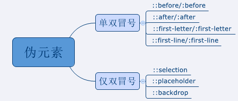
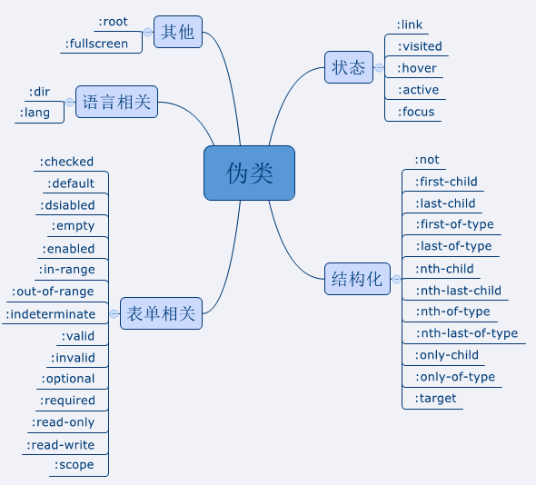
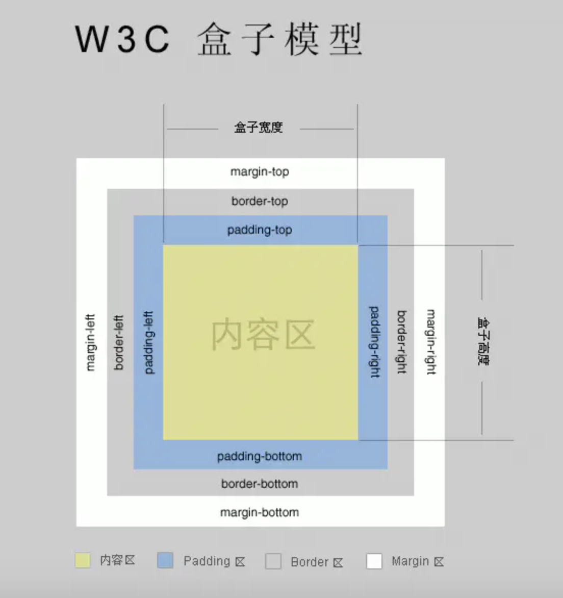

### 1、CSS中 px、em、rem、vw、vh、vmin、vmax 这些单位有什么区别？

**px**
pixel的缩写，意为像素

**em**
参考物是父元素的 `font-size`

**rem**
参考物是根元素html的 `font-size`

**vw**、**vh**
1vw等于视窗宽度的1%；
1vh等于视窗高度的1%；

**vmin**
vw和vh中较小的那个

**vmax**
vw和vh中较大的那个

### 2、伪类 与 伪元素有哪些区别？

伪类的操作对象是文档树中已有的元素，而伪元素则创建了一个文档数外的元素。因此，伪类与伪元素的区别在于：**有没有创建一个文档树之外的元素。**

伪类和伪元素有如下：





相关链接：
[总结伪类与伪元素](http://www.alloyteam.com/2016/05/summary-of-pseudo-classes-and-pseudo-elements/)

### 3、flex设置成 1 和 auto 有什么区别？

如下样式是等同的：

```css
.item {flex: 1;}
.item {
  flex-grow: 1;
  flex-shrink: 1;
  flex-basis: 0%;
}
```

如下样式是等同的：

```css
.item {flex: auto;}
.item {
  flex-grow: 1;
  flex-shrink: 1;
  flex-basis: auto;
}
```

相关链接：
[flex设置成1和auto有什么区别](https://segmentfault.com/q/1010000004080910)

### 4、rgba() 和 opacity 的透明效果有什么不同？

`opacity` 作用于元素以及元素内的所有内容（包括文字）的透明度；

`rgba()` 只作用于元素自身的颜色或其背景色，子元素不会继承透明效果；

### 5、如何定义一个动画？

```html
<style>
  div {
    width: 100px;
    height: 100px;
    background: red;
    position: relative;
    /* linear 表示线性变化 */
    /* infinite 表示动画无限执行 */
    /* alternate 表示动画的运行状态往返执行 */
    animation: myfirst 1s linear infinite alternate;
  }

  @keyframes myfirst {
    0% {
      background: red;
      left: 0px;
      top: 0px;
    }
    100% {
      background: blue;
      left: 200px;
      top: 200px;
    }
  }
</style>
<div></div>
```

### 6、BFC 是什么？它有什么用？

BFC 即 `Block Formatting Contexts` (块级格式化上下文)，具有 BFC 特性的元素可以看作是隔离了的独立容器，容器里面的元素不会在布局上影响到外面的元素。

通俗一点来讲，可以把 BFC 理解为一个封闭的大箱子，箱子内部的元素无论如何翻江倒海，都不会影响到外部。

#### 如何触发 BFC？

满足以下条件之一即可触发 BFC ：

- position 为 `absolute`、`fixed`
- display 为 `inline-block`、`flex`
- overflow 为 `hidden`、`auto`、`scroll`

#### BFC 有什么用？

1. 清除浮动
1. 避免外边距发生折叠

参考链接：
[10 分钟理解 BFC 原理](https://zhuanlan.zhihu.com/p/25321647)

### 7、标准盒模型 与 IE盒模型 的区别？




### 8、如何用 CSS 创建一个三角形?

```html
<style>
  div {
    width: 0;
    height: 0;
    border-width: 20px;
    border-style: solid;
    border-color: transparent transparent gray transparent;
  }
</style>
<div></div>
```
