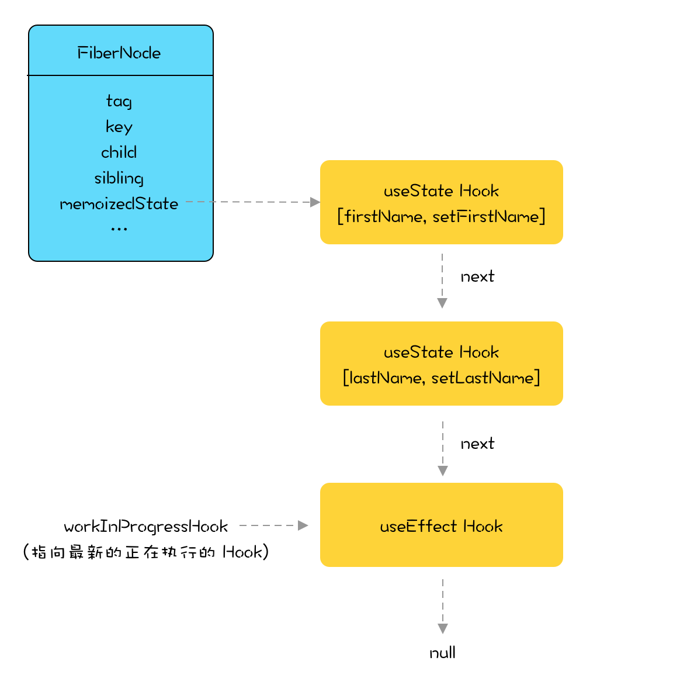
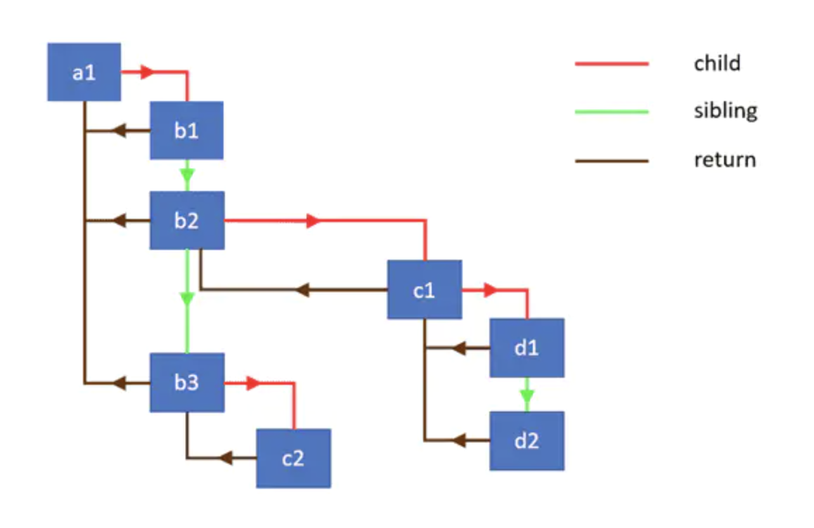

### 1、setState 是异步还是同步？

1. 合成事件中是异步
1. 钩子函数中的是异步
1. 原生事件中是同步
1. setTimeout中是同步

相关链接：
[你真的理解setState吗？](https://juejin.im/post/6844903636749778958)

### 2、聊聊 react@16.4 + 的生命周期


相关连接：
[React 生命周期](https://projects.wojtekmaj.pl/react-lifecycle-methods-diagram/)
[我对 React v16.4 生命周期的理解](https://juejin.im/post/6844903655372488712)

### 3、useEffect(fn, []) 和 componentDidMount 有什么差异？

`useEffect` 会捕获 `props` 和 `state`。所以即便在回调函数里，你拿到的还是初始的 `props` 和 `state`。如果想得到“最新”的值，可以使用 `ref`。

### 4、hooks 为什么不能放在条件判断里？

以 `setState` 为例，在 react 内部，每个组件(Fiber)的 hooks 都是以链表的形式存在 `memoizeState` 属性中：



update 阶段，每次调用 `setState`，链表就会执行 next 向后移动一步。如果将 `setState` 写在条件判断中，假设条件判断不成立，没有执行里面的 `setState` 方法，会导致接下来所有的 `setState` 的取值出现偏移，从而导致异常发生。

参考链接：
[烤透 React Hook](https://juejin.im/post/6867745889184972814)

### 5、fiber 是什么？

**React Fiber 是一种基于浏览器的单线程调度算法。**

React Fiber 用类似 `requestIdleCallback` 的机制来做异步 diff。但是之前数据结构不支持这样的实现异步 diff，于是 React 实现了一个类似链表的数据结构，将原来的 递归diff 变成了现在的 遍历diff，这样就能做到异步可更新了。



相关链接：
[React Fiber 是什么？](https://github.com/WangYuLue/react-in-deep/blob/main/02.React%20Fiber%20%E6%98%AF%E4%BB%80%E4%B9%88%EF%BC%9F.md)

### 6、聊一聊 diff 算法

传统 diff 算法的时间复杂度是 O(n^3)，这在前端 render 中是不可接受的。为了降低时间复杂度，react 的 diff 算法做了一些妥协，放弃了最优解，最终将时间复杂度降低到了 O(n)。

那么 react diff 算法做了哪些妥协呢？，参考如下：

1、tree diff：只对比同一层的 dom 节点，忽略 dom 节点的跨层级移动

如下图，react 只会对相同颜色方框内的 DOM 节点进行比较，即同一个父节点下的所有子节点。当发现节点不存在时，则该节点及其子节点会被完全删除掉，不会用于进一步的比较。

这样只需要对树进行一次遍历，便能完成整个 DOM 树的比较。


这就意味着，如果 dom 节点发生了跨层级移动，react 会删除旧的节点，生成新的节点，而不会复用。

2、component diff：如果不是同一类型的组件，会删除旧的组件，创建新的组件


3、element diff：对于同一层级的一组子节点，需要通过唯一 id 进行来区分

如果没有 id 来进行区分，一旦有插入动作，会导致插入位置之后的列表全部重新渲染。

这也是为什么渲染列表时为什么要使用唯一的 key。

### 7、调用 setState 之后发生了什么？

1. 在 `setState` 的时候，React 会为当前节点创建一个 `updateQueue` 的更新列队。
1. 然后会触发 `reconciliation` 过程，在这个过程中，会使用名为 Fiber 的调度算法，开始生成新的 Fiber 树， Fiber 算法的最大特点是可以做到异步可中断的执行。
1. 然后 `React Scheduler` 会根据优先级高低，先执行优先级高的节点，具体是执行 `doWork` 方法。
1. 在 `doWork` 方法中，React 会执行一遍 `updateQueue` 中的方法，以获得新的节点。然后对比新旧节点，为老节点打上 更新、插入、替换 等 Tag。
1. 当前节点 `doWork` 完成后，会执行 `performUnitOfWork` 方法获得新节点，然后再重复上面的过程。
1. 当所以节点都 `doWork` 完成后，会触发 `commitRoot` 方法，React 进入 commit 阶段。
1. 在 commit 阶段中，React 会根据前面为各个节点打的 Tag，一次性更新整个 dom 元素。

### 8、为什么虚拟dom 会提高性能?

虚拟dom 相当于在 JS 和真实 dom 中间加了一个缓存，利用 diff 算法避免了没有必要的 dom 操作，从而提高性能。

### 9、错误边界是什么？它有什么用？

在 React 中，如果任何一个组件发生错误，它将破坏整个组件树，导致整页白屏。这时候我们可以用错误边界优雅地降级处理这些错误。

例如下面封装的组件：

```tsx
class ErrorBoundary extends React.Component<IProps, IState> {
  constructor(props: IProps) {
    super(props);
    this.state = { hasError: false };
  }

  static getDerivedStateFromError() {
    // 更新 state 使下一次渲染能够显示降级后的 UI
    return { hasError: true };
  }

  componentDidCatch(error, errorInfo) {
    // 可以将错误日志上报给服务器
    console.log('组件奔溃 Error', error);
    console.log('组件奔溃 Info', errorInfo);
  }

  render() {
    if (this.state.hasError) {
      // 你可以自定义降级后的 UI 并渲染
      return this.props.content;
    }
    return this.props.children;
  }
}
```

### 10、什么是 Portals？

Portal 提供了一种将子节点渲染到存在于父组件以外的 DOM 节点的优秀的方案。

```tsx
ReactDOM.createPortal(child, container)
```
